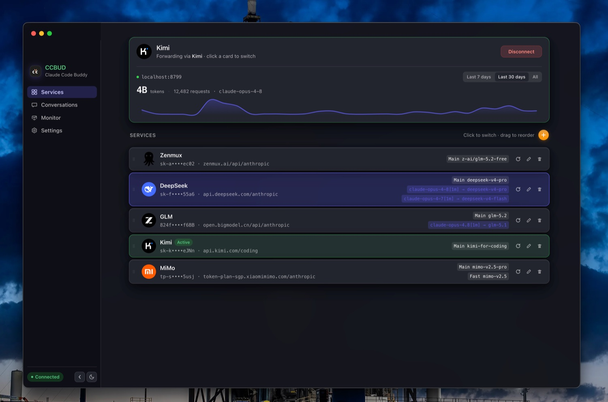
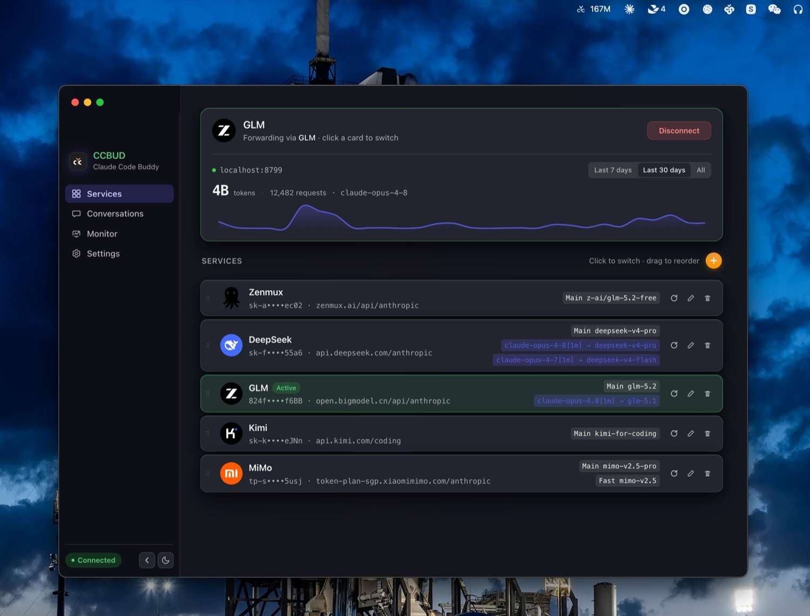
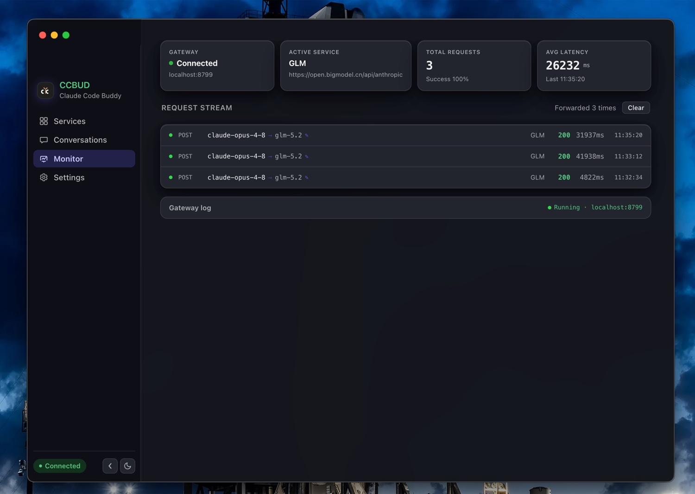
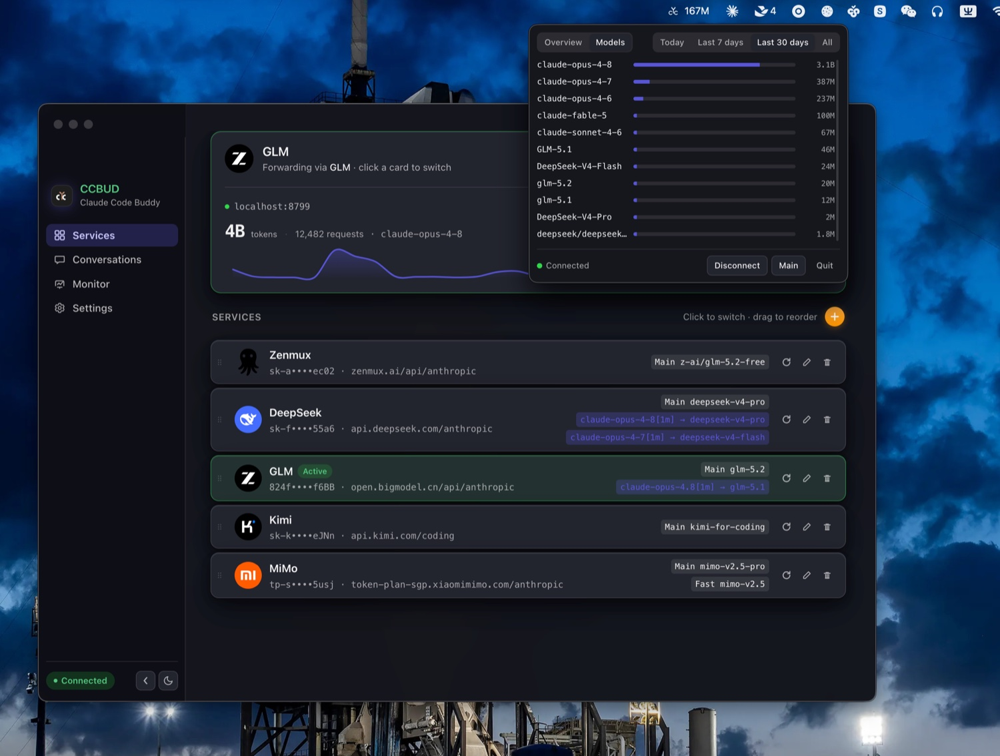
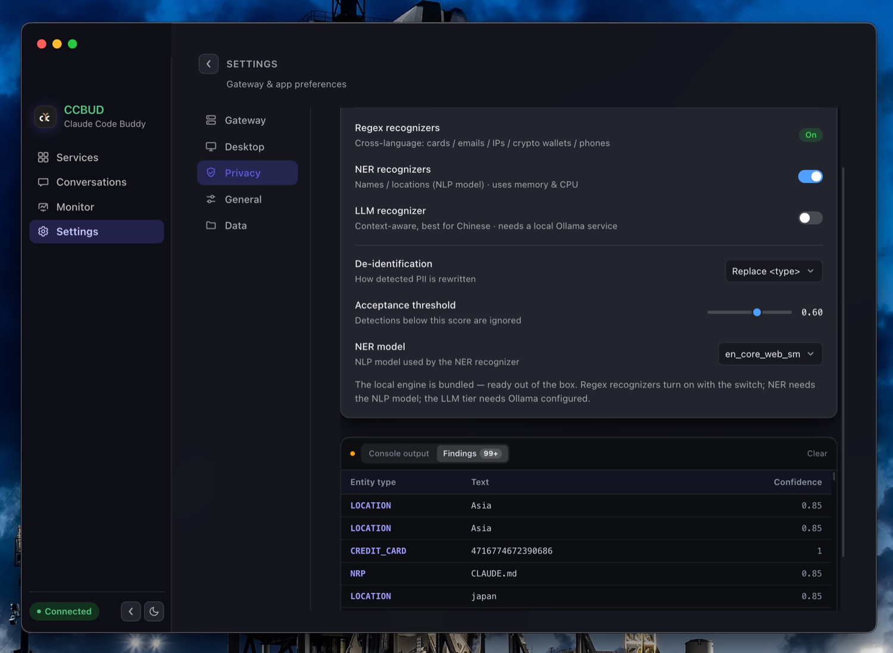

<div align="center">


# CCBuddy

### 编码 CLI 好搭子

**让 Claude Code 接到任意 Anthropic 兼容服务商 —— 一键接入，全程本地。**

[](#-安装)
[](https://tauri.app/)
[](./LICENSE)

[安装](#-安装) · [快速开始](#-快速开始) · [工作原理](#-工作原理)

[English](./README.md) · **简体中文**

</div>

---

**CCBuddy**（`CC` coding CLI + `Buddy` 伙伴）是一个跨平台桌面应用，在 Claude Code 和任意 Anthropic 兼容服务商（Kimi、DeepSeek、GLM、MiMo 等）之间起一个**本地网关**。服务商添加一次，点一下卡片就切换，Claude Code 的配置由 CCBuddy 自动写好 —— **你不用碰任何环境变量。**

<div align="center">
  
</div>

- **一键接入** —— CCBuddy 自动写好 `~/.claude/settings.json`，断开时再原样还原。
- **即时切换** —— 多家服务并存，点一下卡片立刻换。
- **自动模型映射** —— Claude 的默认模型名自动路由到当前服务商的模型。
- **全程本地** —— 网关只绑定 `127.0.0.1`，数据不出本机。

## 📥 安装

### 下载（推荐）

从 **[Releases 页面](https://github.com/ccbud/ccbud/releases)** 下载对应平台的安装包：

| 平台 | 文件 |
| :-- | :-- |
| **macOS**（Apple 芯片 & Intel） | `.dmg` |
| **Windows** | `.exe` 安装包 |
| **Linux** | `.AppImage` / `.deb` |

> **macOS 首次打开被拦截：** 右键点应用 → **打开**，或执行
> `xattr -dr com.apple.quarantine "/Applications/CC Buddy.app"`。

### Homebrew（macOS）

```bash
brew install --cask ccbud/tap/ccbud   # 首次安装
brew upgrade --cask ccbud             # 后续升级
```

### 保持最新（应用内更新）

CCBuddy 会在启动时（以及每天）检查新版本，并在 **设置 → 关于与更新** 中提示。可用时应用内通过 Tauri updater 更新；Homebrew 用户也可以执行 `brew upgrade --cask ccbud`。

### 从源码构建

```bash
git clone https://github.com/ccbud/ccbud.git
cd ccbud
npm install
npm start                 # 开发模式运行 Tauri 应用

# 打包当前系统的发行版：
npm run dist:mac          # 或：dist:win · dist:linux
```

## 🚀 快速开始

**1 · 添加服务商**
打开 CCBuddy，点 **`+`**，选预设（GLM · DeepSeek · MiMo · Kimi …）或填自定义 base URL，粘贴 API Key。

<div align="center"></div>

**2 · 接入**
点首页大按钮 **「接入」**。CCBuddy 会把网关地址写进 `~/.claude/settings.json` 的 `env.ANTHROPIC_BASE_URL` / `env.ANTHROPIC_AUTH_TOKEN`，接入前的配置会自动备份。

**3 · 用 Claude Code**
新开一个 Claude Code 会话即生效，已经在你选的服务商上。想换服务点另一张卡片即可；点 **「断开接入」** 会把你原来的配置原样还原。使用期间保持 CCBuddy 运行 —— 关闭窗口会缩到菜单栏 / 托盘继续工作。

## 🔧 工作原理

```text
Claude Code ──(ANTHROPIC_BASE_URL = 127.0.0.1:port)──▶ CCBuddy 网关 ──▶ 激活的服务商
                                                          │
                                          · 替换为上游真实 token
                                          · 模型名路由 / 映射
                                          · 把响应里的 model 名改回客户端期望的值
```

CCBuddy **不修改任何第三方服务的配置**，只在本机起一个转发 server。用「别名」时，网关会把响应里的 `model` 字段（含流式 `message_start`）改回别名，保证客户端看到的就是它请求的名字。未配置 `ANTHROPIC_MODEL` 时，Claude Code 发来的 `claude-*` 默认模型名会被映射到激活服务商的主模型（含 `haiku` → 小模型）。

## 📸 走进来看看

| | |
| :--: | :--: |
| <br>一键切换服务商、映射模型 | <br>实时看着每个请求流过 |
| <br>用量一目了然 —— 菜单栏也能看 | <br>敏感信息出门前先抹掉 |

## 📄 许可证

基于 [GPL-3.0](./LICENSE) 协议开源。
